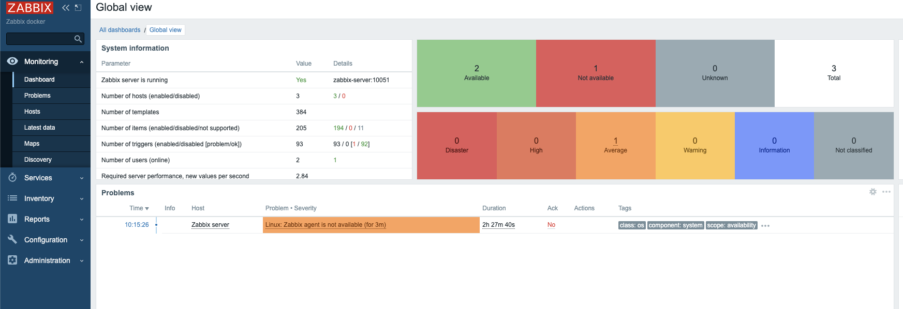

# Отказоустойчивая инфраструктура в Yandex Cloud

Дипломный инфраструктурный проект: Terraform создаёт облачную инфраструктуру, Ansible настраивает сервисы на VM. Репозиторий показывает полный контур - сеть, private/public сегменты, bastion, балансировку, мониторинг, централизованные логи и резервное копирование.

> Публичный README намеренно не содержит актуальных runtime IP, паролей и готовых данных входа. Скриншоты фиксируют состояние учебного стенда на момент выполнения проекта.

## Архитектура

```text
Internet
   |
Application Load Balancer
   |
+-----------------------------+
| private-a       private-b   |
| web-a           web-b       |
+-----------------------------+
   |                 |
   +------ logs -----+
             |
       Elasticsearch
             |
          Kibana

Bastion -> SSH к private VM
Zabbix -> мониторинг web VM
NAT Gateway -> исходящий доступ private subnet
Snapshot schedule -> резервные копии дисков
```

## Что реализовано

- VPC и три подсети: public, private-a, private-b
- NAT Gateway и route table для private-сегмента
- security groups по ролям
- bastion-host как единственная SSH-точка входа к внутренним VM
- две web VM в разных зонах доступности
- Application Load Balancer перед web-слоем
- Nginx на web VM через Ansible
- Zabbix server + agents для мониторинга
- Elasticsearch + Kibana для централизованного просмотра логов
- Filebeat на web VM для доставки nginx/system/auth логов
- ежедневные snapshot schedules с ограниченным retention
- Terraform outputs для сервисных идентификаторов и адресов

## Стек

`Yandex Cloud` · `Terraform` · `Ansible` · `Nginx` · `Docker` · `Zabbix` · `Elasticsearch` · `Kibana` · `Filebeat`

## Структура репозитория

```text
terraform/             инфраструктура Yandex Cloud
ansible/               inventory + playbooks
ansible/playbooks/     настройка web/monitoring/logging
img/                   скриншоты этапов и результата
```

## Сеть и изоляция

Web-серверы находятся во внутренних подсетях и не имеют публичных IP. Внешний HTTP-трафик приходит через Application Load Balancer.

SSH к внутренним VM разрешён только через bastion. Доступ между ролями ограничен security groups: например, web принимает трафик от ALB, а Zabbix agents - только от monitoring-сегмента.

Private VM получают исходящий интернет-доступ через NAT Gateway, поэтому им не нужны публичные адреса для установки пакетов и обновлений.

Скриншоты:


## Terraform

Terraform описывает:

- network / subnets / route table
- NAT Gateway
- VM по ролям
- security groups
- target group и ALB
- snapshot schedules
- outputs

Локальные значения и секреты не должны попадать в Git:

- `terraform.tfvars`
- `*.tfstate`
- service-account key JSON
- SSH private keys

Для входных значений есть `terraform/terraform.tfvars.example`.

Базовая проверка:

```bash
cd terraform
terraform init
terraform fmt -check
terraform validate
terraform plan
```

## Ansible

Playbooks настраивают:

- Nginx на web VM
- Zabbix server и agents
- Elasticsearch
- Kibana
- Filebeat

Пример проверки inventory:

```bash
cd ansible
ansible all -m ping
```

### Zabbix database password

Пароль базы Zabbix не хранится в репозитории. Перед запуском server playbook задаётся окружением:

```bash
export ZABBIX_DB_PASSWORD='use-a-strong-secret-here'
ansible-playbook playbooks/zabbix-server.yml
```

Playbook откажется запускаться, если переменная отсутствует или слишком короткая.

После первого запуска web-интерфейса стандартные учётные данные приложения необходимо заменить до публикации интерфейса в интернет.

## Мониторинг

Zabbix server развёрнут отдельно. На обеих web VM работают agents. Monitoring traffic разрешён только между соответствующими security groups.

В интерфейсе проверялись:

- доступность web-hosts
- latest data
- графики метрик




## Централизованные логи

Elasticsearch размещён во внутренней сети без публичного IP. Kibana работает отдельным frontend-узлом. Filebeat на web VM читает:

- `/var/log/nginx/access.log`
- `/var/log/nginx/error.log`
- `/var/log/syslog`
- `/var/log/auth.log`

и отправляет события в Elasticsearch по внутренней сети.


## Резервное копирование

Для дисков VM настроено ежедневное snapshot schedule с ограниченным сроком хранения. Это даёт автоматическую точку восстановления без ручного создания snapshots.


## Security notes

- private keys, tfstate и tfvars исключены через `.gitignore`
- service-account key JSON не хранится в Git
- web VM не публикуются напрямую
- SSH к private VM идёт через bastion
- сервисные порты ограничены security groups
- Zabbix DB password вынесен из source в `ZABBIX_DB_PASSWORD`
- runtime IP и данные входа не используются в README как публичные endpoints

## Связанные направления

Этот проект подтверждает инфраструктурную часть full-stack/backend работы. Когда поверх инфраструктуры нужен API, серверная логика, база данных или интеграции:

- Backend-разработка: https://alexgtup.github.io/backend-development/?utm_source=github&utm_medium=repository&utm_campaign=sys_diplom_yc
- Основное портфолио: https://alexgtup.github.io/?utm_source=github&utm_medium=repository&utm_campaign=sys_diplom_yc
