## диплом netology - отказоустойчивая инфраструктура для сайта в yandex cloud

terraform - инфраструктура, ansible - настройка софта на vm

репозиторий: terraform/ (код) + img/ (скрины)

## содержание

- 1 сеть и подсети
- 2 nat и маршрутизация private
- 3 terraform outputs
- 4 security groups
- 5 bastion
- 6 web vm x2 + alb
- 7 monitoring: zabbix + agents
- 8 logs: elasticsearch + kibana + filebeat
- 9 резервное копирование: snapshots schedule

## 1 сеть и подсети

создан vpc `sys-diplom` и 3 подсети
public (ru-central1-a)
private-a (ru-central1-a)
private-b (ru-central1-b)

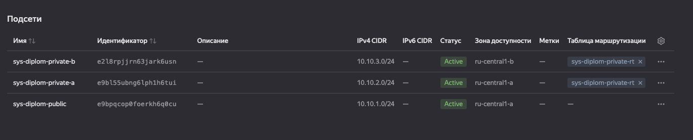

## 2 nat и маршрутизация private

для private подсетей включен исходящий доступ в интернет через nat gateway
создана route table с маршрутом `0.0.0.0/0` через nat и привязана к private-a и private-b

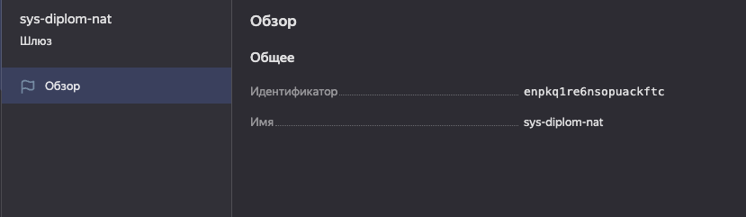
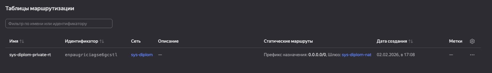
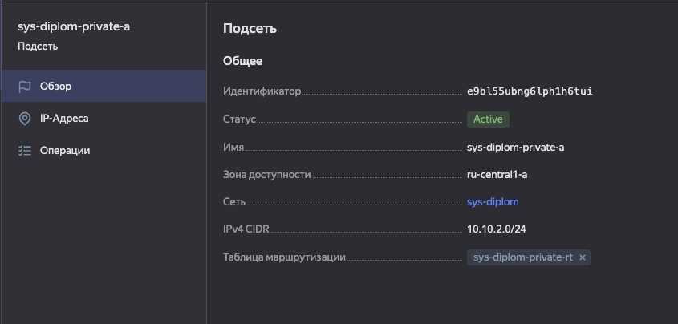
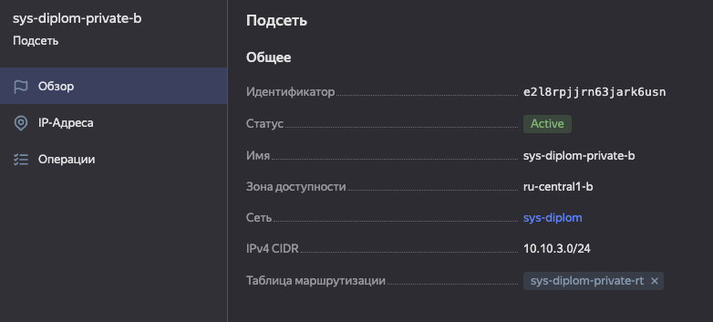

## 3 terraform outputs

terraform outputs используются для удобной проверки и быстрого доступа к данным инфраструктуры (например, внешние ip публичных vm, ip alb и т.п.)

пример:

```bash
cd terraform
terraform output
```

## 4 security groups

sg разнесены по ролям: bastion, web, zabbix, elastic, kibana, alb
наружу открыты только нужные порты, ssh к внутренним vm только через bastion

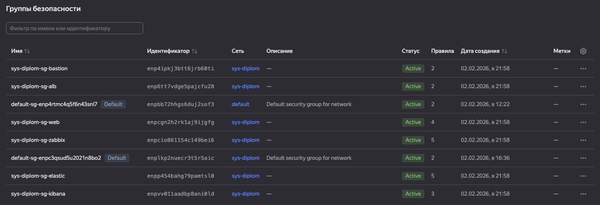
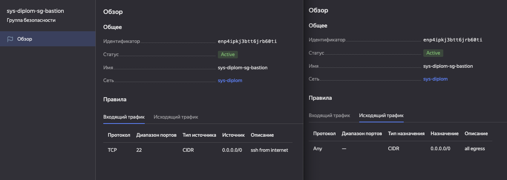
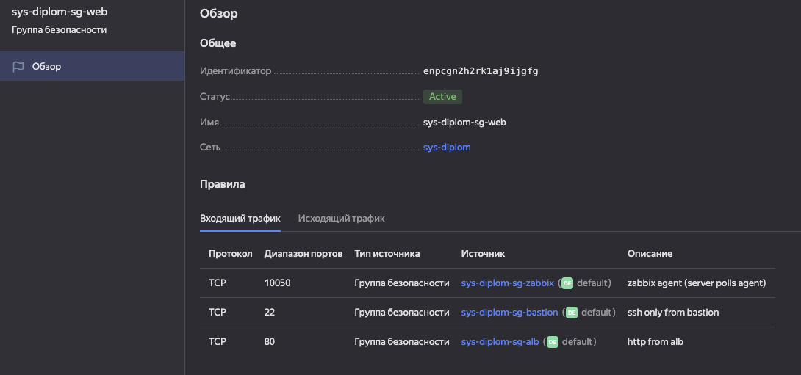
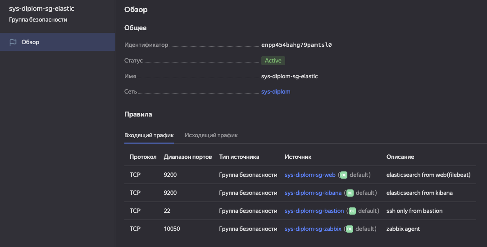
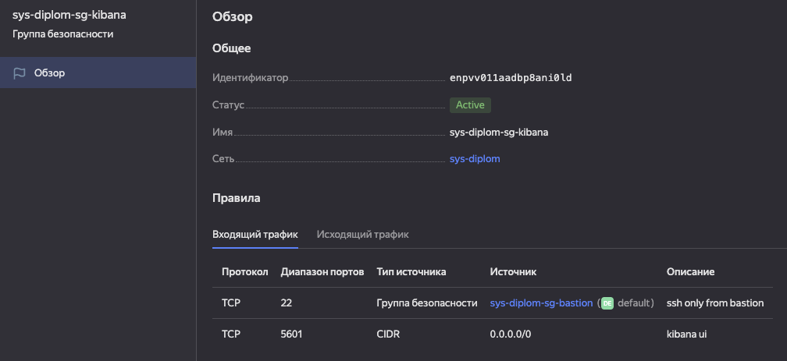

## 5 bastion

vm `bastion` в public подсети с публичным ip, вход только ssh

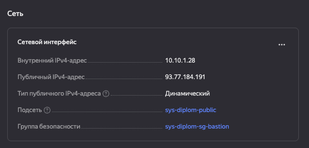

## 6 web vm x2 + alb

внутри приватного контура подняты два одинаковых web-сервера в разных зонах, наружу сайт отдаётся только через application load balancer

```
- сайт (через ALB): http://158.160.224.121
```

### 6.1 web vm (private)

web vm:

- `web-a` - `sys-diplom-private-a (ru-central1-a)`, `10.10.2.4`, `web-a.ru-central1.internal`
- `web-b` - `sys-diplom-private-b (ru-central1-b)`, `10.10.3.5`, `web-b.ru-central1.internal`

у web vm нет публичных ip, подключение по ssh только через bastion

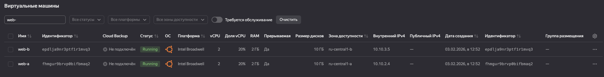

внутренние fqdn (используются в ansible inventory, без привязки к ip)

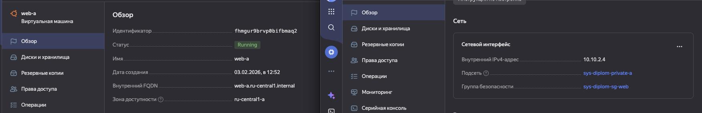
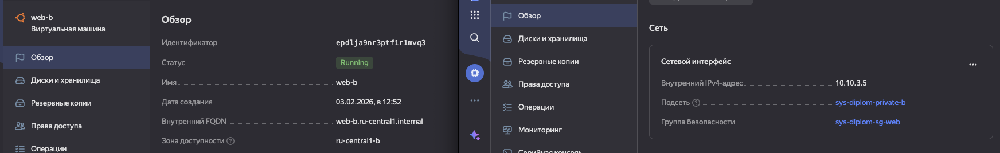

### 6.2 application load balancer (public)

alb принимает http снаружи и балансирует трафик между `web-a` и `web-b`

- public ip alb: `158.160.224.121`

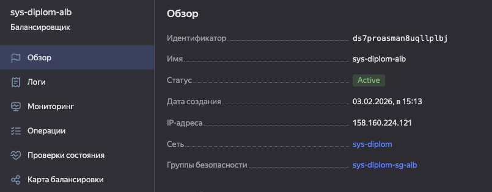

### 6.3 security groups (alb -> web)

доступы сделаны так, чтобы до web нельзя было достучаться напрямую:

- `sys-diplom-sg-alb` - открыт `80` наружу + `loadbalancer_healthchecks`
- `sys-diplom-sg-web` - `80` только от `sys-diplom-sg-alb`, `22` только от `sys-diplom-sg-bastion`

итог: сайт доступен только через alb, ssh только через bastion

### 6.4 nginx + тестовая страница (ansible на bastion)

nginx и тестовая страница накатаны на обе web vm через:

- `ansible/playbooks/web.yml`

проверка, что bastion видит внутренние vm:

```bash
ansible all -m ping
```

## 7 monitoring: zabbix + agents

под мониторинг поднята отдельная vm `zabbix` в public подсети, zabbix server + web ui развернуты через docker compose (postgres + zabbix-server + zabbix-web)

web ui доступен снаружи по публичному ip zabbix vm.

```
- Zabbix UI: http://93.77.178.139/
- логин: Admin / zabbix

```

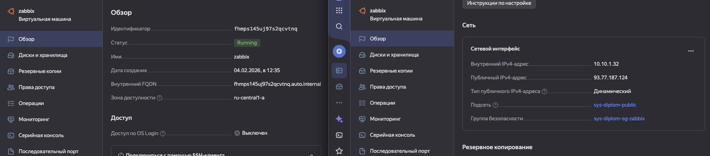
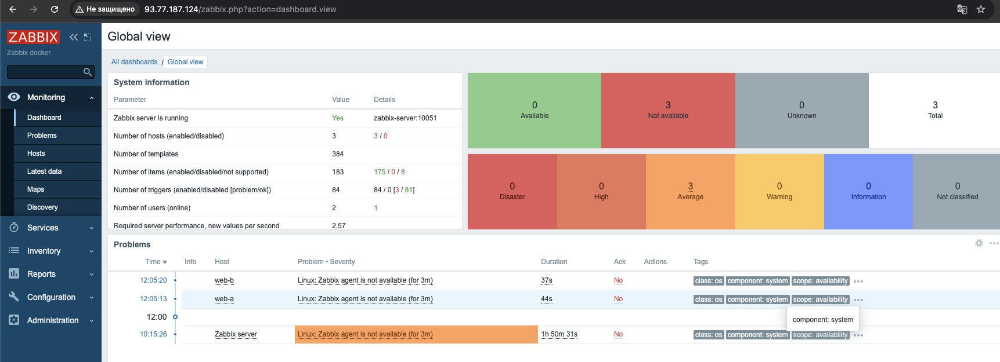

на `web-a` и `web-b` установлен `zabbix-agent`, сервер опрашивает агентов по `10050/tcp` (в sg web вход на 10050 разрешён только от sg zabbix)

плейбук: `ansible/playbooks/zabbix-agent.yml`

в интерфейсе zabbix добавлены хосты `web-a` и `web-b` с подключением по dns `*.ru-central1.internal:10050`, после чего начинают поступать метрики и доступны latest data / graphs

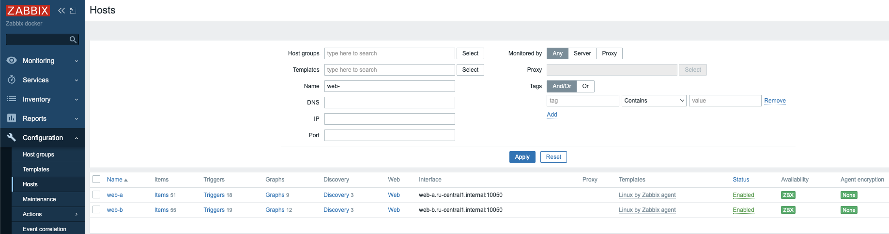
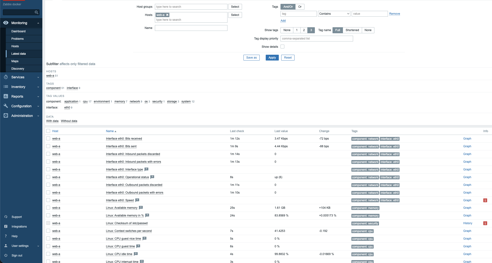

---

## 8 logs: elasticsearch + kibana + filebeat

логи nginx с web vm собираются filebeat и отправляются в elasticsearch, визуализация через kibana

```
- Kibana: http://89.169.142.16:5601/app/home#/

```

### 8.1 elasticsearch (private)

vm `elastic1` находится в приватной подсети, без публичного ip
доступ по `22/tcp` только с bastion, `9200/tcp` только от web/kibana (через security groups)

проверка на elastic:

```bash
curl -sS http://127.0.0.1:9200
curl -sS "http://127.0.0.1:9200/_cat/health?v"
curl -sS "http://127.0.0.1:9200/_cat/indices?v" | egrep "filebeat|kibana|geoip" || true
```

- compute cloud - vm `elastic1` (overview)

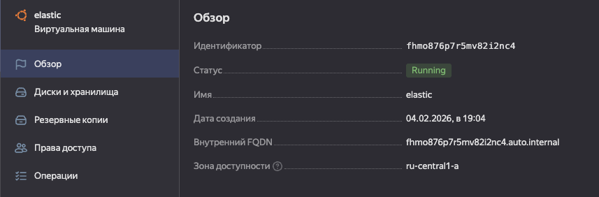

### 8.2 kibana (public)

vm `kibana1` находится в public подсети и доступна извне по `5601/tcp`
kibana подключена к elasticsearch по внутреннему адресу

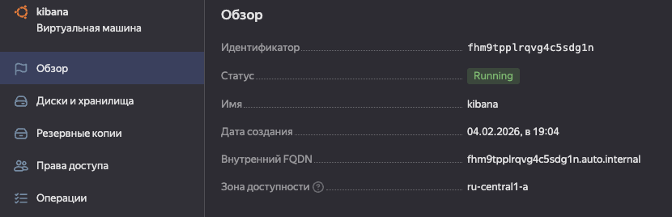

### 8.3 filebeat на web vm

из-за проблем с apt-репозиторием elastic (403) filebeat развёрнут контейнером docker на `web-a` и `web-b`filebeat читает логи:

- `/var/log/nginx/access.log`
- `/var/log/nginx/error.log`
- `/var/log/syslog`
- `/var/log/auth.log`

и отправляет в elasticsearch `elastic1:9200`

проверка, что filebeat работает (на bastion):

```bash
ansible -i ansible/inventory/hosts.ini web -b -m shell -a "docker ps --filter name=filebeat"
ansible -i ansible/inventory/hosts.ini web -b -m shell -a "docker logs --tail=20 filebeat | tail -n 20"
```

проверка индексов (на bastion):

```bash
ansible -i ansible/inventory/hosts.ini elastic1 -b -m shell -a 'curl -sS "http://127.0.0.1:9200/_cat/indices?v" | egrep "filebeat|kibana|geoip" || true'
```

если кластер 1-нода, чтобы индекс filebeat стал green, отключаем реплики:

```bash
ansible -i ansible/inventory/hosts.ini elastic1 -b -m shell -a 'curl -sS -X PUT "http://127.0.0.1:9200/filebeat-*/_settings" -H "Content-Type: application/json" -d "{\"index\":{\"number_of_replicas\":0}}"'
```

Kibana - Stack Management - Index Patterns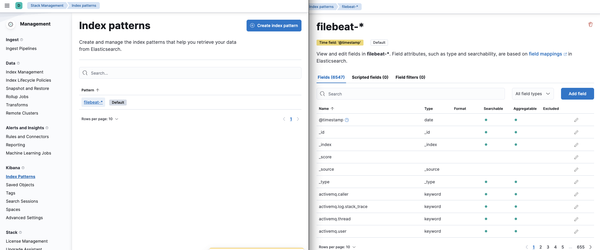

Kibana - Discover - выбран `filebeat-*`, видны события/логи

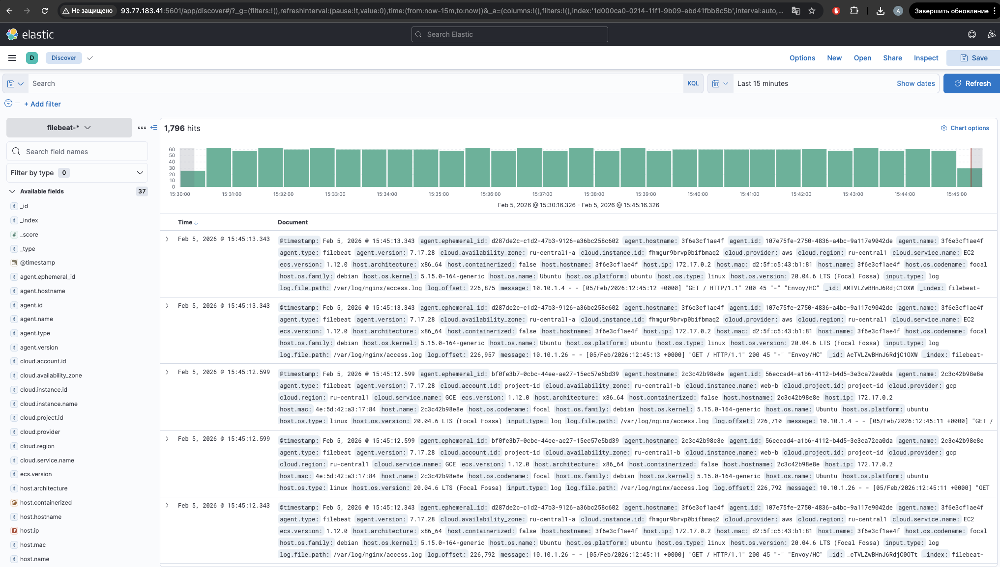

## 9 резервное копирование: snapshots schedule

настроено ежедневное создание snapshot дисков всех vm, хранение 7 дней

список расписаний snapshot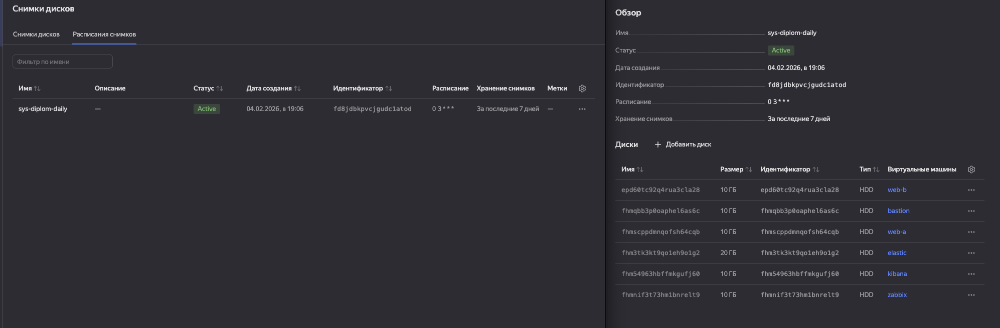

карточка расписания (daily + retention 7 days)

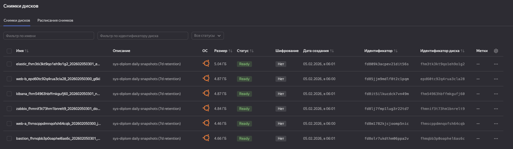
